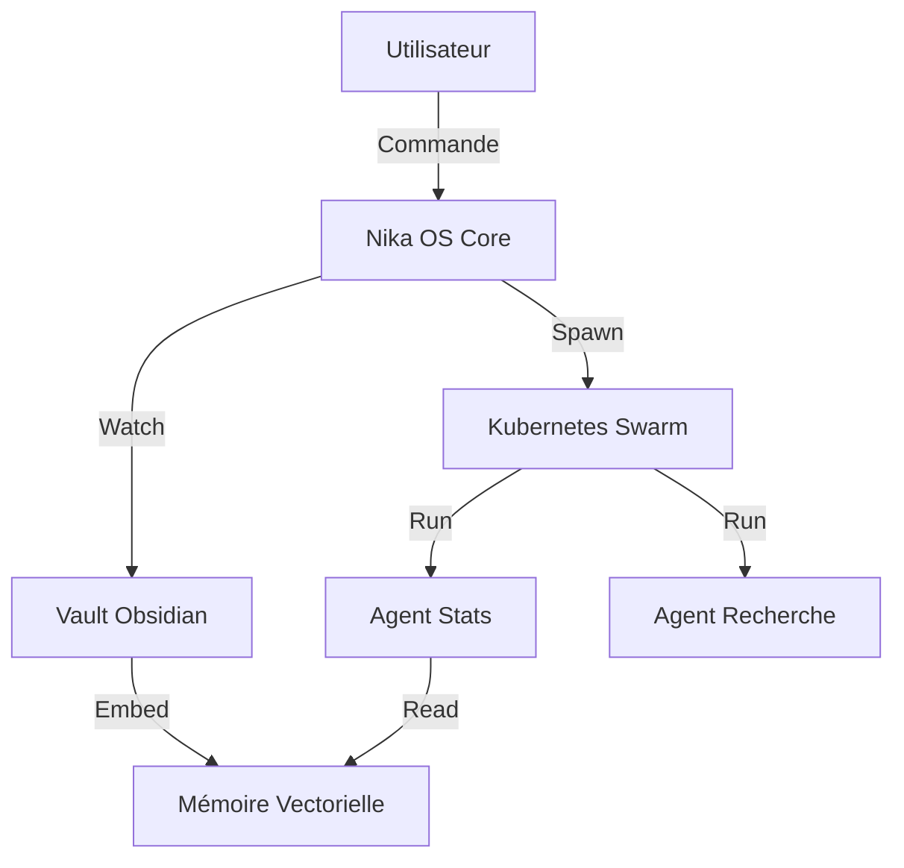

# Nika OS (ex-Gemini CLI)

> **Système de Pilotage d'Agents Autonomes & Swarm Intelligence**
> *Forked from @google/gemini-cli - Enhanced for Pulsai Operations*

[](https://github.com/Powwpol/gemini-cli)
[](./k8s/nika-swarm.yaml)
[](./packages/cli/src/services/ragWatcher.ts)


**Nika OS** est une évolution radicale du Gemini CLI, transformant un simple outil de chat en un **Système d'Exploitation pour Agents IA Autonomes**. Il intègre nativement la mémoire persistante (RAG), l'orchestration fractale (Swarm) et l'automatisation temporelle (CRON).

## 🚀 Pourquoi Nika OS ?

Au-delà des capacités standard de Gemini, Nika OS apporte :

*   **🧠 Contexte Infini & RAG Natif** : Surveillance temps réel de vos dossiers de connaissances (`70_Resources`, `80_Knowledge`). Chaque fiche créée est instantanément vectorisée et disponible pour tous les agents.
*   **🐝 Swarm Intelligence (K8s)** : Capacité de "Spawn" fractal. Un agent Nika peut instancier des sous-agents éphémères dans un cluster Kubernetes pour paralléliser des tâches complexes.
*   **⏰ Autonomie (CRON)** : Gestionnaire de tâches planifiées intégré. Nika se réveille seul pour effectuer des rapports (Daily/Weekly) ou des maintenances.
*   **📊 Science des Données Native** : Pile Python intégrée (NumPy, Pandas, SciPy) pour l'exécution directe de tests statistiques avancés (Taguchi, Weibull, Kelly Criterion).
*   **🎨 Pulsai Branding** : Interface optimisée pour le confort visuel (Dark Theme, High Contrast) et l'identité Pulsai.

## 📦 Installation & Démarrage

### Pré-requis
*   Node.js v20+
*   Docker Desktop (avec Kubernetes activé pour le mode Swarm)
*   Python 3.10+ (pour les modules Stats)

### Installation Globale

```powershell
# Cloner le repo
git clone https://github.com/Powwpol/gemini-cli Nika-CLI
cd Nika-CLI

# Compiler et Lier
npm run build:packages
npm run bundle
npm link

# Vérifier
nika --version
```

## 🛠️ Fonctionnalités Exclusives Nika

### 1. Swarm Spawning
Déléguez une tâche lourde à un agent esclave dans le cluster :

```bash
nika swarm spawn "Analyse les logs de production et cherche des anomalies Taguchi"
```

### 2. Gestionnaire CRON
Activez le pilote automatique pour vos rapports récurrents :

```bash
nika cron start
```
*Gère automatiquement les Morning Standups et Daily Summaries définis dans `cron/cron_jobs.json`.*

### 3. RAG Watcher
Lancez le CLI, et il surveille vos fichiers Markdown.
*   **Ajout d'une note Obsidian** -> **Indexation Qdrant immédiate**.
*   Aucune action manuelle requise.

### 4. Multimodalité (En cours)
*   [x] Traitement Texte & Code
*   [x] Analyse de Données (CSV/JSON/Python)
*   [ ] Audio (Processing via ffmpeg intégré)
*   [ ] Vision (Analyse d'images/schémas techniques)

## 🏗️ Architecture



## 🔐 Sécurité & Authentification

Nika OS conserve les méthodes d'authentification robustes de Gemini CLI :
*   **OAuth Google** (Recommandé pour le contexte 1M tokens)
*   **API Key** (Pour les scripts CI/CD)
*   **Vertex AI** (Pour les déploiements Enterprise)

## 🤝 Contribution & Roadmap

Ce projet est un fork maintenu pour les besoins opérationnels de **Pulsai**.
Les contributions alignées avec la vision **Autonomous Swarm** sont bienvenues.

**Roadmap 2026 :**
*   **Q1** : Stabilisation du Swarm K8s & RAG Watcher (✅ Fait).
*   **Q2** : Skill Factory (Génération automatique de connecteurs MCP).
*   **Q3** : Finetuning de SLM (Small Language Models) locaux pour les tâches spécialisées.
*   **Q4** : Interface TUI (Terminal User Interface) multi-panneaux.

---
*Basé sur le travail exceptionnel de l'équipe Google Gemini CLI.*